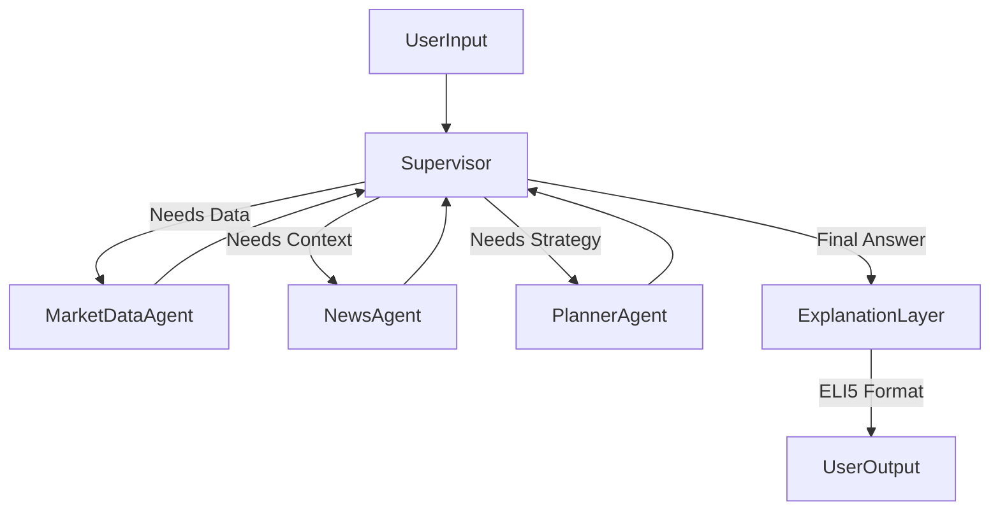

# Architecture Patterns

**Domain:** Personal Financial Assistant (LangGraph)
**Researched:** 2024

## Recommended Architecture: The "Supervisor" Pattern

A centralized "Supervisor" (LLM) decides which specialized worker to call, or if the user needs to be answered directly.



### Component Boundaries

| Component | Responsibility | Tools |
|-----------|---------------|-------|
| **Supervisor** | Intent classification, routing, state management. | None (Decision maker) |
| **MarketDataAgent** | Fetching hard numbers (Price, PE, Volatility). | `finnhub_quote`, `yfinance_history` |
| **NewsAgent** | Finding qualitative context. | `finnhub_news`, `ddg_search` |
| **PlannerAgent** | Running calculations for scenarios (Retirement, Savings). | `compound_interest_calc`, `inflation_adjuster` |
| **ExplanationLayer** | Re-writing final output for tone/clarity. | System Prompt: "You are a patient tutor..." |

### Data Flow

1.  **Input:** User asks "Is Apple safe for my retirement?"
2.  **Supervisor:** Detects intent -> Needs `Market Data` (Volatility) and `News` (Sentiment).
3.  **Routing:** 
    - Call `MarketDataAgent` -> Returns "AAPL Beta: 1.2, Volatility: Med".
    - Call `NewsAgent` -> Returns "Recent lawsuit news...".
4.  **Synthesis:** Supervisor combines data into a raw technical answer.
5.  **Explanation:** `ExplanationLayer` translates "Beta 1.2" to "Apple moves a bit more than the average market, like a boat in choppy water."

## Patterns to Follow

### Pattern 1: Tool-Use for Numbers (No Hallucinations)
**What:** NEVER let the LLM guess a stock price.
**Example:**
```python
# Bad
response = llm.invoke("What is AAPL price?")

# Good
@tool
def get_price(ticker):
    return finnhub_client.quote(ticker)
```

### Pattern 2: The "Guardrails" Post-Processor
**What:** A final check for compliance before showing the user.
**Why:** To catch "I recommend buying X" slips.
**Implementation:** A lightweight LLM call or regex check that flags "buy/sell" imperatives and converts them to "Analyst consensus suggests..."

## Anti-Patterns to Avoid

### Anti-Pattern 1: The "God Agent"
**What:** One single agent with 20 tools.
**Why bad:** Confuses the LLM, context window clutter, harder to debug.
**Instead:** Split into `Market`, `News`, `Planner` agents.

## Scalability Considerations

| Concern | Approach |
|---------|----------|
| **Rate Limits** | Cache stock prices in SQLite/Redis for 1-5 minutes. Don't fetch on every token. |
| **Context Window** | Summarize news articles *inside* the NewsAgent before returning to Supervisor. |

## Sources

- LangGraph Examples (Supervisor Pattern).
- Financial Data Engineering best practices.
