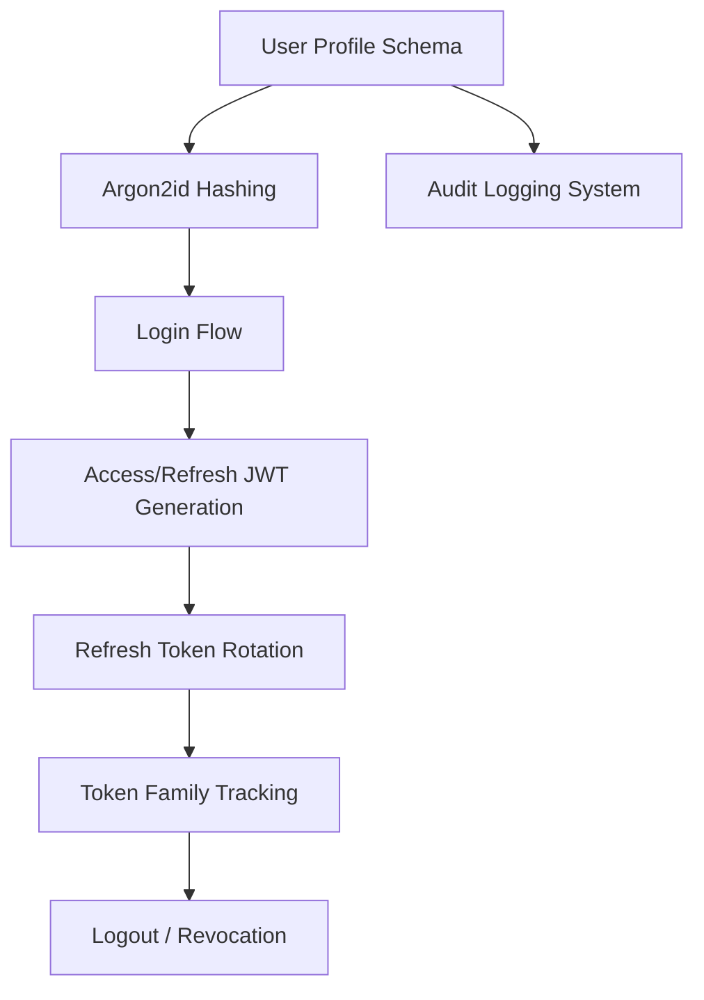
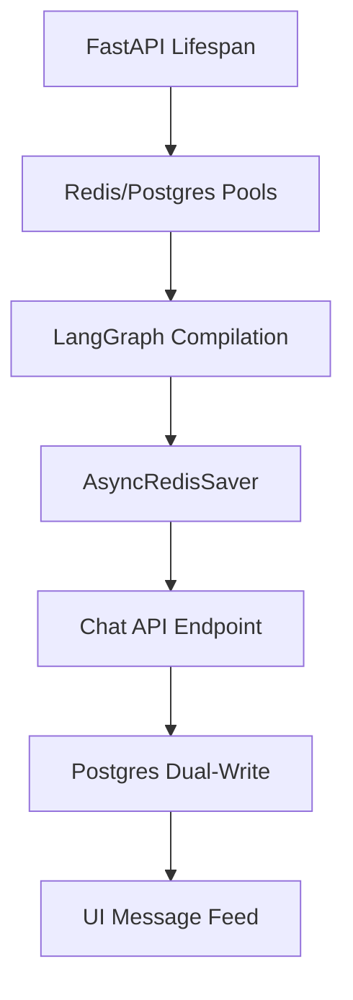

# Feature Landscape: Authentication & Security

**Domain:** Financial Services (Mobile-First)
**Researched:** 2025-05-24
**Confidence:** HIGH

## Table Stakes (Required for Compliance & Security)

Features essential for any secure financial application.

| Feature | Why Expected | Complexity | Notes |
|---------|--------------|------------|-------|
| **JWT Access/Refresh** | Performance + Scalability | Med | Standard for modern REST APIs. |
| **Argon2id Hashing** | Brute-force Resistance | Low | Industry gold standard (RFC 9106). |
| **Refresh Token Rotation**| Session Security | Med | Prevents stale token reuse. |
| **Token Family Tracking** | Breach Detection | High | Critical for mobile security. |
| **UUIDv7 Identifiers** | Privacy + Performance | Low | Prevents enumeration, allows time-based sort. |
| **PII Encryption** | GDPR/SOC2 Compliance | High | Encryption at rest (AES-256-GCM). |

## Differentiators (Security-First Features)

Features that provide enhanced security and trust.

| Feature | Value Proposition | Complexity | Notes |
|---------|-------------------|------------|-------|
| **Step-up Auth** | Protection for High-Value Ops | High | Require MFA for specific actions (e.g. withdrawal). |
| **Biometric Verification**| Mobile UX + Security | Med | Integrated with device Keystore/Keychain. |
| **Immutable Audit Logs** | Forensic Capability | Med | Tamper-proof record of profile changes. |
| **Consent Management** | Regulatory Compliance | Low | Track T&C versions and timestamps. |

## Anti-Features (Avoid These)

| Anti-Feature | Why Avoid | What to Do Instead |
|--------------|-----------|-------------------|
| **Local Storage JWT** | XSS Vulnerability | Use HttpOnly, Secure Cookies (Web) or OS Secure Enclaves (Mobile). |
| **Plain Text PII** | Data Breach Risk | Use Field-Level Encryption (FLE). |
| **Implicit Flow** | Authorization Leakage | Use Authorization Code Flow with PKCE. |
| **Long-Lived Access** | Replay Attack Window | Keep Access Tokens < 15 mins. |

## Feature Dependencies

## MVP Recommendation

Prioritize:
1.  **Core Login/Registration** with **Argon2id** and **UUIDv7**.
2.  **Access/Refresh JWT flow** with **Refresh Token Rotation**.
3.  **Basic Secure Schema** with `mfa_enabled`, `last_login`, and `ip_address` tracking.
4.  **Database-backed Refresh Token storage** for persistence and revocation.

---

# Feature Landscape: AI Memory & State Persistence

**Domain:** Stock Analysis / Agentic AI
**Researched:** 2025-05-24
**Confidence:** HIGH

## Table Stakes

Features users expect in an agentic chat application.

| Feature | Why Expected | Complexity | Notes |
|---------|--------------|------------|-------|
| **Conversation Persistence** | Resume chat after refresh. | Med | Uses `thread_id` to reload state. |
| **Human-Readable History** | View previous messages in UI. | Med | Requires relational Postgres table. |
| **Stateful Agents** | Agents remember previous steps. | Low | Core LangGraph functionality. |
| **Thread Isolation** | Private conversations per user. | Low | Map `user_id` to `thread_id`. |

## Differentiators

Features that set the product apart.

| Feature | Value Proposition | Complexity | Notes |
|---------|-------------------|------------|-------|
| **"Time Travel"** | Replay or fork conversation. | High | Redis checkpointer stores history nodes. |
| **Streaming UI** | Real-time response feedback. | Med | `astream` support for tokens/events. |
| **Automatic Cleanup** | ephemeral sessions via TTL. | Low | Native Redis TTL support in checkpointer. |
| **Rich Metadata Logs** | Audit tool calls and cost. | Med | Store tool outputs in Postgres `metadata`. |

## Anti-Features

| Anti-Feature | Why Avoid | What to Do Instead |
|--------------|-----------|-------------------|
| **JSON Blobs for UI** | Hard to query/filter. | Map to Relational `chat_messages` table. |
| **Infinite In-Memory History**| Memory leaks. | Use Redis with TTL or sliding window. |
| **Global Agent Instance** | Thread safety issues. | Compile graph once, instantiate state per run. |

## Feature Dependencies

## MVP Recommendation

Prioritize:
1.  **Redis-backed LangGraph state** (Transient).
2.  **Postgres-backed message table** (Permanent).
3.  **Basic "Dual-Write" logic** in FastAPI controller.

## Sources
- [LangGraph Persistence Guide](https://langchain-ai.github.io/langgraph/how-tos/persistence/)
- [RedisJSON Documentation](https://redis.io/docs/latest/develop/data-types/json/)
