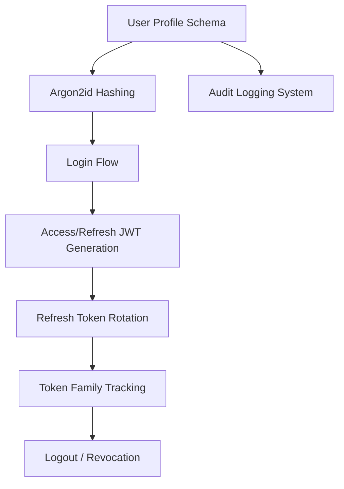

# Feature Landscape: Authentication & Security

**Domain:** Financial Services (Mobile-First)
**Researched:** 2025-05-24
**Confidence:** HIGH

## Table Stakes (Required for Compliance & Security)

Features essential for any secure financial application.

| Feature | Why Expected | Complexity | Notes |
|---------|--------------|------------|-------|
| **JWT Access/Refresh** | Performance + Scalability | Med | Standard for modern REST APIs. |
| **Argon2id Hashing** | Brute-force Resistance | Low | Industry gold standard (RFC 9106). |
| **Refresh Token Rotation**| Session Security | Med | Prevents stale token reuse. |
| **Token Family Tracking** | Breach Detection | High | Critical for mobile security. |
| **UUIDv7 Identifiers** | Privacy + Performance | Low | Prevents enumeration, allows time-based sort. |
| **PII Encryption** | GDPR/SOC2 Compliance | High | Encryption at rest (AES-256-GCM). |

## Differentiators (Security-First Features)

Features that provide enhanced security and trust.

| Feature | Value Proposition | Complexity | Notes |
|---------|-------------------|------------|-------|
| **Step-up Auth** | Protection for High-Value Ops | High | Require MFA for specific actions (e.g. withdrawal). |
| **Biometric Verification**| Mobile UX + Security | Med | Integrated with device Keystore/Keychain. |
| **Immutable Audit Logs** | Forensic Capability | Med | Tamper-proof record of profile changes. |
| **Consent Management** | Regulatory Compliance | Low | Track T&C versions and timestamps. |

## Anti-Features (Avoid These)

| Anti-Feature | Why Avoid | What to Do Instead |
|--------------|-----------|-------------------|
| **Local Storage JWT** | XSS Vulnerability | Use HttpOnly, Secure Cookies (Web) or OS Secure Enclaves (Mobile). |
| **Plain Text PII** | Data Breach Risk | Use Field-Level Encryption (FLE). |
| **Implicit Flow** | Authorization Leakage | Use Authorization Code Flow with PKCE. |
| **Long-Lived Access** | Replay Attack Window | Keep Access Tokens < 15 mins. |

## Feature Dependencies

## MVP Recommendation

Prioritize:
1.  **Core Login/Registration** with **Argon2id** and **UUIDv7**.
2.  **Access/Refresh JWT flow** with **Refresh Token Rotation**.
3.  **Basic Secure Schema** with `mfa_enabled`, `last_login`, and `ip_address` tracking.
4.  **Database-backed Refresh Token storage** for persistence and revocation.

Defer: **Step-up Auth**, **Field-Level Encryption**, **Redis-based Blacklisting** (initially use Database).

## Sources
- [OWASP Top 10 API Security](https://owasp.org/www-project-api-security/)
- [NIST Special Publication 800-63B (Digital Identity)](https://pages.nist.gov/800-63-3/sp800-63b.html)
- [Financial Data Security Best Practices (2025)](https://www.fca.org.uk/firms/security-best-practices)
